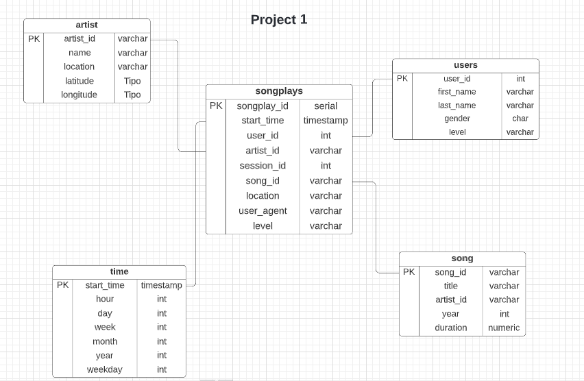

<h3 align="center">Data Modeling ETL with PostgreSQL</h3>
<p align="center">
 Udacity Data Engineer Nanodegree Course Project 1
 <br />
</p>


# About the Project

In this project, we will model a database based on a music streaming scenario, the modeling will be done from Postgres and we will create an ETL using Python, we will define a fact table and four other dimension tables, in a schema star and an ETL pipeline will be written that will transfer the data from two Json files in local directories to our database.

Neste projeto, será feito a modelagem de um banco de dados baseado em um cenário de streaming de música, a modelagem será feita a partir do Postgres e criaremos uma ETL usando Python, defineremos uma tabela fato e outras quatro tabelas dimensões, em um schema star e será escrito um pipeline ETL que irá transferir os dados de dois arquivos Json em diretórios locais para o nosso banco de dados.

# Project Description

A startup called Sparkify wants to analyze the data they've been collecting on songs and user activity on their new music streaming app. The analytics team is particularly interested in understanding what songs users are listening to. Currently, they don't have an easy way to query their data, which resides in a directory of JSON logs on user activity on the app, as well as a directory with JSON metadata on the songs in their app.

They'd like a data engineer to create a Postgres database with tables designed to optimize queries on song play analysis, and bring you on the project. Your role is to create a database schema and ETL pipeline for this analysis. You'll be able to test your database and ETL pipeline by running queries given to you by the analytics team from Sparkify and compare your results with their expected results.

Uma startup chamada Sparkify quer analisar os dados coletados em músicas e atividades do usuário em seu novo aplicativo de streaming de música. A equipe de análise está particularmente interessada em entender quais músicas os usuários estão ouvindo. Atualmente, eles não têm uma maneira fácil de consultar seus dados, que residem em um diretório de logs JSON sobre a atividade do usuário no aplicativo, bem como um diretório com metadados JSON nas músicas em seu aplicativo.

Eles gostariam que um engenheiro de dados criasse um banco de dados Postgres com tabelas projetadas para otimizar consultas na análise de reprodução de músicas e trazer você para o projeto. Sua função é criar um esquema de banco de dados e um pipeline ETL para essa análise. Você poderá testar seu banco de dados e pipeline de ETL executando consultas fornecidas pela equipe de análise do Sparkify e comparar seus resultados com os resultados esperados.

# Tools Used

* Python
* PostgreSQL
* Jupyter notebooks

# Datasets

The first dataset is a subset of real data from the [Million Song Dataset](http://millionsongdataset.com/). Each file is in JSON format and contains metadata about a song and the artist of that song. The files are partitioned by the first three letters of each song's track ID. For example, here are file paths to two files in this dataset.

O primeiro conjunto de dados é um subconjunto de dados reais do conjunto de dados de milhões de músicas. Cada arquivo está no formato JSON e contém metadados sobre uma música e o artista dessa música. Os arquivos são particionados pelas três primeiras letras do ID da faixa de cada música. Por exemplo, aqui estão os caminhos de arquivo para dois arquivos neste conjunto de dados.

```
{"num_songs": 1, "artist_id": "ARJIE2Y1187B994AB7", "artist_latitude": null, "artist_longitude": null, "artist_location": "", "artist_name": "Line Renaud", "song_id": "SOUPIRU12A6D4FA1E1", "title": "Der Kleine Dompfaff", "duration": 152.92036, "year": 0}
```


The second dataset consists of log files in JSON format generated by this [event simulator](https://github.com/Interana/eventsim) based on the songs in the dataset above. These simulate activity logs from a music streaming app based on specified configurations.

O segundo conjunto de dados consiste em arquivos de log no formato JSON gerados por este simulador de eventos com base nas músicas do conjunto de dados acima. Eles simulam registros de atividades de um aplicativo de streaming de música com base em configurações especificadas.


# Data Modeling

The modeling was performed using the star schema, with a fact table in the center and four other dimension tables.

A modelagem foi realizada utilizando o esquema de estrela, com uma tabela fato no centro e outras quatro tabelas dimensões




# Project Structure

|File/Folder| File/Folder Description |
| --- | --- |
| data | The root of project, where are the datas of songs and logs |
| images | Where it is stored as images used in the project |
| create_tables.py | File used to connect to the database, and call the create, insert and drop functions of the created tables |
| sql_queries.py | File used to store the creation, insertion and drop codes of the tables used in the project. |
| etl.ipynb | Template to follow for storing song_data and log_data files and inserting them into tables. |
| test.ipynb | Template to validate the inserts in the tables. |
| etl.py | File to store song_data and log_data files and insert them into tables |
| README.md | Readme |

# How to Execute

Clone the repository on your machine run through the command.
```git clone https://github.com/MBicalho/Data_Engineer_Nanodegree.git```

# Tools to Execute the project

* Python
* PostgreSQL
* Pandas, psycopg2 and glob libraries

# Step by Step

* Run the file ```create_tables.py```
```python create_tables.py```
* Run the file ```etl.py```
```python etl.py```
* Test with the ```test.ipynb```

# Contact
Matheus Bicalho [mbicalho.freitas@gmail.com]
Linkedin: [https://www.linkedin.com/in/matheus-bicalho-0a5835205/]
