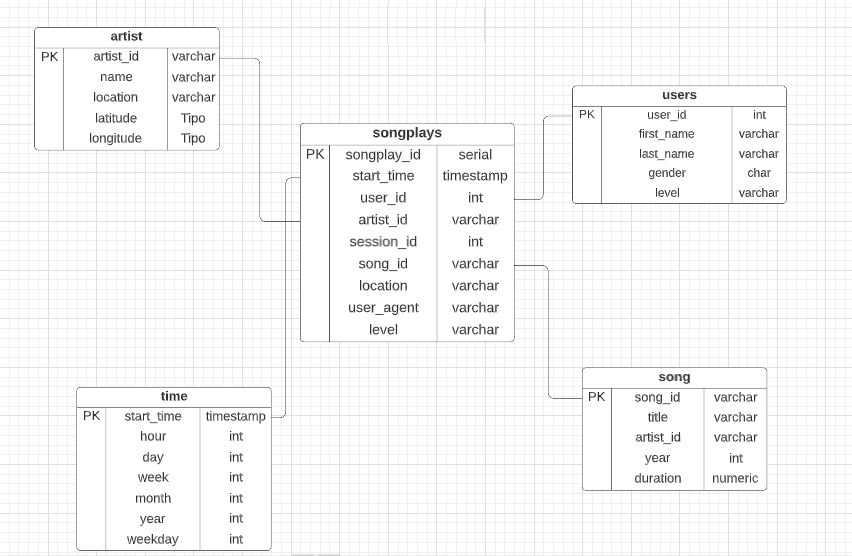
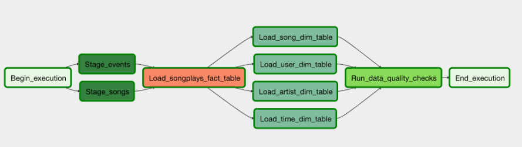

<h3 align="center">Data Pipelines</h3>
<p align="center">
 Udacity Data Engineer Nanodegree Course Project 5
 <br />
</p>


# About the Project

This project will introduce the main concepts of Apache Airflow. I will create my own custom operators to perform tasks such as preparing the data, populating the data warehouse, and running checks on the data as a final step.

Este projeto apresentará os principais conceitos do Apache Airflow. Irei criar meus próprios operadores personalizados para executar tarefas como preparar os dados, preencher o data warehouse e executar verificações nos dados como etapa final.

# Project Description

A music streaming company, Sparkify, has decided that it is time to introduce more automation and monitoring to their data warehouse ETL pipelines and come to the conclusion that the best tool to achieve this is Apache Airflow.

They have decided to bring you into the project and expect you to create high grade data pipelines that are dynamic and built from reusable tasks, can be monitored, and allow easy backfills. They have also noted that the data quality plays a big part when analyses are executed on top the data warehouse and want to run tests against their datasets after the ETL steps have been executed to catch any discrepancies in the datasets.

The source data resides in S3 and needs to be processed in Sparkify's data warehouse in Amazon Redshift. The source datasets consist of JSON logs that tell about user activity in the application and JSON metadata about the songs the users listen to.

A empresa de streaming de música, Sparkify, decidiu que é hora de introduzir mais automação e monitoramento em seus pipelines ETL de data warehouse e chegar à conclusão de que a melhor ferramenta para conseguir isso é o Apache Airflow.

Eles decidiram trazê-lo para o projeto e esperam que você crie pipelines de dados de alto nível que são dinâmicos e construídos a partir de tarefas reutilizáveis, podem ser monitorados e permitem preenchimentos fáceis. Eles também notaram que a qualidade dos dados desempenha um papel importante quando as análises são executadas no data warehouse e desejam executar testes em seus conjuntos de dados após a execução das etapas de ETL para detectar quaisquer discrepâncias nos conjuntos de dados.

Os dados de origem residem no S3 e precisam ser processados ​​no data warehouse do Sparkify no Amazon Redshift. Os conjuntos de dados de origem consistem em logs JSON que informam sobre a atividade do usuário no aplicativo e metadados JSON sobre as músicas que os usuários ouvem.

# Tools Used

* Python
* PostgreSQL
* Apache Airflow
* AWS

# Datasets

Two datasets residing on S3 were used.
* Song data: ```s3://udacity-dend/song_data```
* Song data: ```s3://udacity-dend/log_data```

Log data json path: ```s3://udacity-dend/log_json_path.json```

The first dataset is a subset of real data from the [Million Song Dataset](http://millionsongdataset.com/). Each file is in JSON format and contains metadata about a song and the artist of that song. The files are partitioned by the first three letters of each song's track ID. For example, here are file paths to two files in this dataset.

```
song_data/A/B/C/TRABCEI128F424C983.json
song_data/A/A/B/TRAABJL12903CDCF1A.json
```
And below is an example of what a single song file, TRAABJL12903CDCF1A.json, looks like.
```
{"num_songs": 1, "artist_id": "ARJIE2Y1187B994AB7", "artist_latitude": null, "artist_longitude": null, "artist_location": "", "artist_name": "Line Renaud", "song_id": "SOUPIRU12A6D4FA1E1", "title": "Der Kleine Dompfaff", "duration": 152.92036, "year": 0}
```

The second dataset consists of log files in JSON format generated by this event simulator based on the songs in the dataset above. These simulate app activity logs from an imaginary music streaming app based on configuration settings.

The log files in the dataset you'll be working with are partitioned by year and month. For example, here are file paths to two files in this dataset.
```
log_data/2018/11/2018-11-12-events.json
log_data/2018/11/2018-11-13-events.json
```


Foi utlizado dois conjuntos de dados que residem no S3.
* Song data: ```s3://udacity-dend/song_data```
* Song data: ```s3://udacity-dend/log_data```

Log data json path: ```s3://udacity-dend/log_json_path.json```

O primeiro conjunto de dados é um subconjunto de dados reais do [Million Song Dataset](http://millionsongdataset.com/). Cada arquivo está no formato JSON e contém metadados sobre uma música e o artista dessa música. Os arquivos são particionados pelas três primeiras letras do ID da faixa de cada música. Por exemplo, aqui estão os caminhos de arquivo para dois arquivos neste conjunto de dados.

```
song_data/A/B/C/TRABCEI128F424C983.json
song_data/A/A/B/TRAABJL12903CDCF1A.json
```
E abaixo está um exemplo da aparência de um único arquivo de música, TRAABJL12903CDCF1A.json.

```
{"num_songs": 1, "artist_id": "ARJIE2Y1187B994AB7", "artist_latitude": null, "artist_longitude": null, "artist_location": "", "artist_name": "Line Renaud", "song_id": "SOUPIRU12A6D4FA1E1", "title": "Der Kleine Dompfaff", "duration": 152.92036, "year": 0}
```

O segundo conjunto de dados consiste em arquivos de log no formato JSON gerados por este simulador de eventos com base nas músicas do conjunto de dados acima. Eles simulam os logs de atividade do aplicativo de um aplicativo de streaming de música imaginário com base nas configurações.

Os arquivos de log no conjunto de dados com os quais você trabalhará são particionados por ano e mês. Por exemplo, aqui estão os caminhos de arquivo para dois arquivos neste conjunto de dados.

```
log_data/2018/11/2018-11-12-events.json
log_data/2018/11/2018-11-13-events.json
```

# Data Modeling

The model used was the star schema, we will have a fact table and four dimension tables.

The data stored in S3 will be extracted and we will populate our tables in Redshift, the whole process will be handled using Apache Airflow.

O modelo utilizado foi o star schema, teremos uma tabela fato e quatro tabelas dimensões.

Os dados armazenados no S3 serão extraídos e popularemos nossas tabelas no Redshift, todo o processo será manipulado usando o Apache Airflow.




# Project Instructions for Apache Airflow

## Project Template
To get started with the project:

On the project workspace page after the project instructions, you'll find the project template. You can work on your project and submit your work through this workspace. Alternatively, you can download the project template package and put the contents of the package in their respective folders in your local Airflow installation. The project template package contains three major components for the project:

* The dag template has all the imports and task templates in place, but the task dependencies have not been set
* The operators folder with operator templates
* A helper class for the SQL transformations

Para iniciar o projeto:

Na página do espaço de trabalho do projeto após as instruções do projeto, você encontrará o modelo do projeto. Você pode trabalhar em seu projeto e enviar seu trabalho por meio deste espaço de trabalho. Como alternativa, você pode baixar o pacote de modelo de projeto e colocar o conteúdo do pacote em suas respectivas pastas na instalação local do Airflow. O pacote de modelo de projeto contém três componentes principais para o projeto:

* O modelo dag tem todas as importações e modelos de tarefas em vigor, mas as dependências de tarefas não foram definidas
* A pasta de operadores com modelos de operadores
* Uma classe auxiliar para as transformações SQL

## Configuring the DAG
In the DAG, add default parameters according to these guidelines

* The DAG does not have dependencies on past runs
* On failure, the task are retried 3 times
* Retries happen every 5 minutes
* Catchup is turned off
* Do not email on retry

In addition, configure the task dependencies so that after the dependencies are set, the graph view follows the flow shown in the image below.

No DAG, adicione parâmetros padrão de acordo com estas diretrizes

* O DAG não tem dependências de execuções anteriores
* Em caso de falha, a tarefa é repetida 3 vezes
* Novas tentativas acontecem a cada 5 minutos
* Catchup está desativado
* Não envie e-mail ao tentar novamente

Além disso, configure as dependências de tarefas para que, após as dependências serem definidas, a visualização do gráfico siga o fluxo mostrado na imagem abaixo.



## Building the operators
To complete the project, you need to build four different operators that will stage the data, transform the data, and run checks on data quality.

You can reuse the code from Project 2, but remember to utilize Airflow's built-in functionalities as connections and hooks as much as possible and let Airflow do all the heavy-lifting when it is possible.

All of the operators and task instances will run SQL statements against the Redshift database. However, using parameters wisely will allow you to build flexible, reusable, and configurable operators you can later apply to many kinds of data pipelines with Redshift and with other databases.

Para concluir o projeto, você precisa criar quatro operadores diferentes que prepararão os dados, transformarão os dados e executarão verificações na qualidade dos dados.

Você pode reutilizar o código do Projeto 2, mas lembre-se de usar as funcionalidades internas do Airflow como conexões e ganchos o máximo possível e deixe o Airflow fazer todo o trabalho pesado quando possível.

Todos os operadores e instâncias de tarefas executarão instruções SQL no banco de dados Redshift. No entanto, usar parâmetros com sabedoria permitirá que você crie operadores flexíveis, reutilizáveis ​​e configuráveis ​​que podem ser aplicados posteriormente a vários tipos de pipelines de dados com o Redshift e com outros bancos de dados.

## Stage Operator
The stage operator is expected to be able to load any JSON formatted files from S3 to Amazon Redshift. The operator creates and runs a SQL COPY statement based on the parameters provided. The operator's parameters should specify where in S3 the file is loaded and what is the target table.

The parameters should be used to distinguish between JSON file. Another important requirement of the stage operator is containing a templated field that allows it to load timestamped files from S3 based on the execution time and run backfills.

Espera-se que o operador de palco possa carregar qualquer arquivo formatado em JSON do S3 para o Amazon Redshift. O operador cria e executa uma instrução SQL COPY com base nos parâmetros fornecidos. Os parâmetros do operador devem especificar onde no S3 o arquivo é carregado e qual é a tabela de destino.

Os parâmetros devem ser usados ​​para distinguir entre o arquivo JSON. Outro requisito importante do operador de estágio é conter um campo de modelo que permite carregar arquivos com carimbo de data/hora do S3 com base no tempo de execução e executar backfills.

## Fact and Dimension Operators
With dimension and fact operators, you can utilize the provided SQL helper class to run data transformations. Most of the logic is within the SQL transformations and the operator is expected to take as input a SQL statement and target database on which to run the query against. You can also define a target table that will contain the results of the transformation.

Dimension loads are often done with the truncate-insert pattern where the target table is emptied before the load. Thus, you could also have a parameter that allows switching between insert modes when loading dimensions. Fact tables are usually so massive that they should only allow append type functionality.

Com operadores de dimensão e fato, você pode utilizar a classe auxiliar SQL fornecida para executar transformações de dados. A maior parte da lógica está dentro das transformações SQL e espera-se que o operador tome como entrada uma instrução SQL e um banco de dados de destino no qual executar a consulta. Você também pode definir uma tabela de destino que conterá os resultados da transformação.

Os carregamentos de dimensão geralmente são feitos com o padrão truncate-insert em que a tabela de destino é esvaziada antes do carregamento. Assim, você também pode ter um parâmetro que permite alternar entre os modos de inserção ao carregar dimensões. As tabelas de fatos geralmente são tão grandes que devem permitir apenas a funcionalidade do tipo de acréscimo.

## Data Quality Operator
The final operator to create is the data quality operator, which is used to run checks on the data itself. The operator's main functionality is to receive one or more SQL based test cases along with the expected results and execute the tests. For each the test, the test result and expected result needs to be checked and if there is no match, the operator should raise an exception and the task should retry and fail eventually.

For example one test could be a SQL statement that checks if certain column contains NULL values by counting all the rows that have NULL in the column. We do not want to have any NULLs so expected result would be 0 and the test would compare the SQL statement's outcome to the expected result.

O operador final a ser criado é o operador de qualidade de dados, que é usado para executar verificações nos próprios dados. A principal funcionalidade do operador é receber um ou mais casos de teste baseados em SQL junto com os resultados esperados e executar os testes. Para cada teste, o resultado do teste e o resultado esperado precisam ser verificados e, se não houver correspondência, o operador deve gerar uma exceção e a tarefa deve tentar novamente e falhar eventualmente.

Por exemplo, um teste pode ser uma instrução SQL que verifica se determinada coluna contém valores NULL contando todas as linhas que possuem NULL na coluna. Não queremos ter nenhum NULL, então o resultado esperado seria 0 e o teste compararia o resultado da instrução SQL com o resultado esperado.


# Project Structure

|File/Folder| File/Folder Description |
| --- | --- |
| dags | Folder with the root of the project, where the dags are stored |
| helpers | Folder where the file with the SQL queries is located |
| operators | Folder where the files with the operators for perform the dags |
| create_tables | File with the SQL querie to create tables in Redshift |
| images | Folder with the project images |
| README.md | Readme |

# How to Execute

Clone the repository on your machine run through the command.
```git clone https://github.com/MBicalho/Data_Engineer_Nanodegree.git```

# Tools to Execute the project

* Python
* AWS Services
* Apache Airflow

# Step by Step

* Configure Apache Airflow to run on local server;
* Create IAM user in AWS;
* Create Redshift Cluster in AWS;
* Configure Airflow Connection to AWS;
* Configure Airflow connection to Redshift;
* In the Redshift Cluster query editor, execute the ```create_tables.py```;
* In the Apache Airflow, turn the DAG execution to ON;
* Follow the execution;


# Contact
Matheus Bicalho [mbicalho.freitas@gmail.com]
Linkedin: [https://www.linkedin.com/in/matheus-bicalho-0a5835205/]
